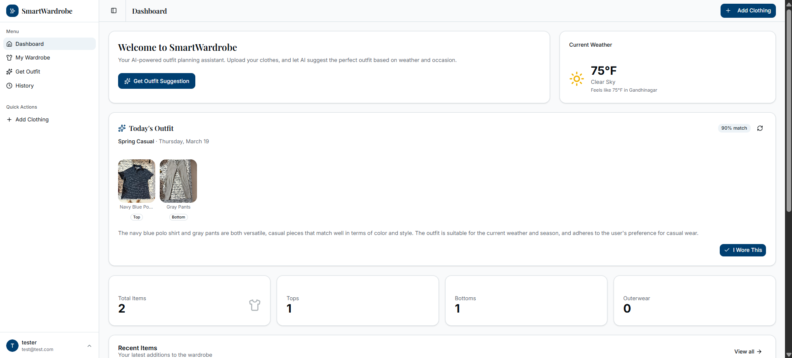
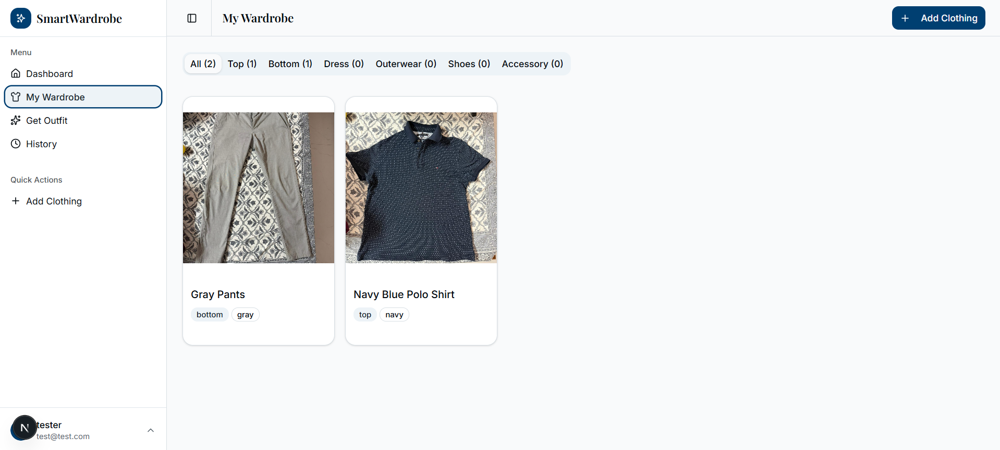
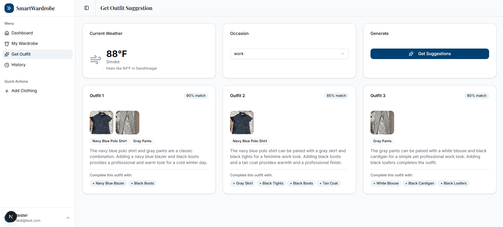
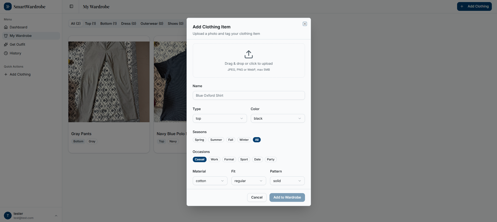
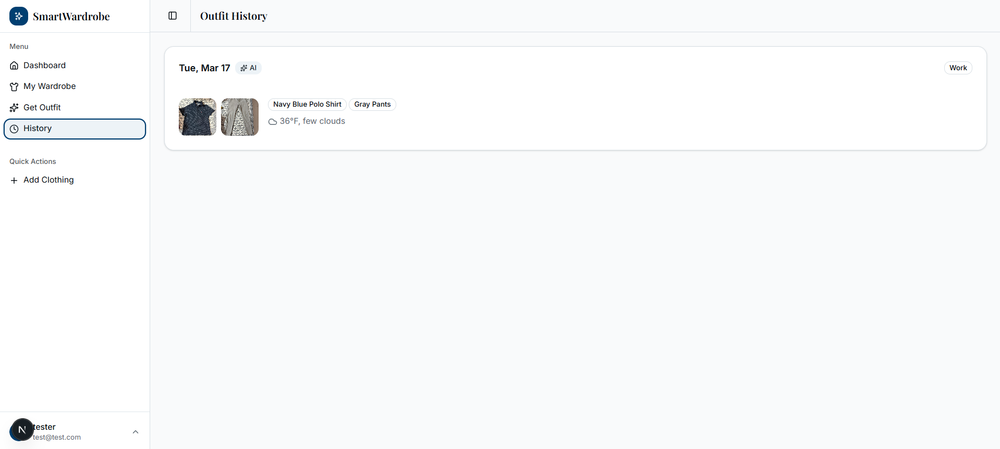
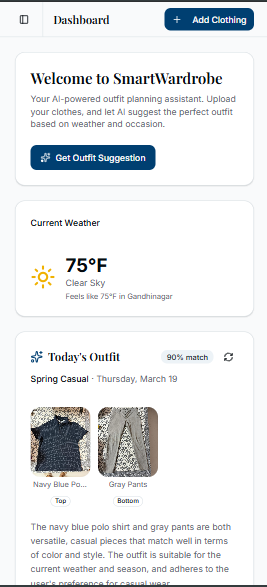

<div align="center">


<br />
<br />

# 👔 SmartWardrobe

## 🌐 Live Demo
https://your-app.vercel.app

**An AI-powered wardrobe management and outfit recommendation web application.**

SmartWardrobe lets you digitally catalog your clothing, automatically analyze items using AI vision, and receive intelligent outfit suggestions tailored to your local weather, occasion, and personal style — all from a clean, modern interface.

---

## ⚡ Key Highlights

- AI-powered clothing recognition using LLM vision  
- Real-time weather-based outfit generation  
- Full-stack app with authentication & secure storage  
- Production-ready architecture with scalable backend  

---

## 💡 Why This Project?

Managing clothes and choosing outfits is a daily problem.  
This project solves it using AI by:

- Automatically analyzing clothing items  
- Reducing decision fatigue  
- Providing context-aware outfit suggestions  

It combines full-stack engineering with real-world usability.

---

[Features](#-features) · [Tech Stack](#-tech-stack) · [Screenshots](#-screenshots) · [Getting Started](#-getting-started) · [Project Structure](#-project-structure) · [Future Improvements](#-future-improvements)

</div>

---

## ✨ Features

### 🧠 AI Clothing Recognition
Upload a photo of any clothing item and the AI automatically detects its type, dominant color, suitable seasons, and appropriate occasions — no manual tagging required.

### 🌤️ Weather-Aware Outfit Suggestions
SmartWardrobe fetches real-time weather data for your location and factors in temperature, conditions, and season when generating outfit recommendations.

### 👗 Smart Outfit Recommendations
Select an occasion and let the AI suggest 3 complete outfit combinations from your wardrobe. The system prioritizes items you haven't worn recently and ensures color coordination. When your wardrobe is small, it suggests complementary items to complete the look.

### 🗂️ Wardrobe Management
Browse your full wardrobe with filtering by clothing type. Add, view, and delete items with a clean card-based interface.

### 📅 Outfit History
Every outfit you choose to wear is saved to your history with the date, occasion, and weather conditions at the time.

### 🔐 Secure Authentication
Full email/password authentication with hashed passwords, JWT sessions, and per-user data isolation. Every piece of data and every image is scoped strictly to the logged-in user.

### 🎨 Gender-Aware Suggestions
Outfit recommendations and accessory suggestions respect the user's gender preference, ensuring contextually appropriate styling advice.

---

## 🛠 Tech Stack

| Layer | Technology |
|---|---|
| **Framework** | Next.js 16 (App Router) |
| **Frontend** | React 19, TypeScript, Tailwind CSS v4 |
| **UI Components** | shadcn/ui (New York style) |
| **Database** | PostgreSQL via Neon (serverless) |
| **Authentication** | NextAuth.js (Credentials provider, JWT sessions) |
| **File Storage** | Vercel Blob (private access) |
| **AI — Vision** | Groq API (`meta-llama/llama-4-scout-17b-16e-instruct`) |
| **AI — Outfits** | Groq API (`meta-llama/llama-4-scout-17b-16e-instruct`) |
| **Weather** | OpenWeatherMap API |
| **Data Fetching** | SWR |
| **Form Handling** | React Hook Form + Zod |
| **Notifications** | Sonner |

---

## 📸 Screenshots

| Dashboard | Wardrobe | Outfit Suggestions |
|---|---|---|
|  |  |  |

| Add Clothing (AI Analysis) | Outfit History | Mobile View |
|---|---|---|
|  |  |  |

---

## 🚀 Getting Started

### Prerequisites

- Node.js 18+
- pnpm (`npm install -g pnpm`)
- A [Neon](https://neon.tech) database
- A [Vercel](https://vercel.com) account (for Blob storage)
- A [Groq](https://console.groq.com) API key
- An [OpenWeatherMap](https://openweathermap.org/api) API key

### 1. Clone the repository

```bash
git clone https://github.com/your-username/smartwardrobe.git
cd smartwardrobe
```

### 2. Install dependencies

```bash
pnpm install
```

### 3. Set up environment variables

Create a `.env.local` file in the root of the project:

```bash
# Database (Neon)
DATABASE_URL=your_neon_connection_string

# NextAuth
NEXTAUTH_SECRET=your_random_secret_string   # generate with: openssl rand -base64 32
NEXTAUTH_URL=http://localhost:3000

# Vercel Blob
BLOB_READ_WRITE_TOKEN=your_vercel_blob_token

# AI
GROQ_API_KEY=your_groq_api_key

# Weather
OPENWEATHERMAP_API_KEY=your_openweathermap_api_key
```

### 4. Set up the database

Run the schema migration in your Neon SQL editor or using the Neon CLI:

```bash
# Copy the contents of scripts/001-create-tables.sql
# and run it in your Neon dashboard → SQL Editor
```

Or connect directly:

```bash
psql $DATABASE_URL -f scripts/001-create-tables.sql
```

### 5. Set up Vercel Blob

1. Go to your [Vercel Dashboard](https://vercel.com/dashboard)
2. Open your project → **Storage** tab
3. Create a new **Blob** store
4. Copy the `BLOB_READ_WRITE_TOKEN` into your `.env.local`

### 6. Start the development server

```bash
pnpm dev
```

Open [http://localhost:3000](http://localhost:3000) in your browser.

---

## 📁 Project Structure

```
smartwardrobe/
├── app/
│   ├── api/
│   │   ├── analyze-clothing/   # AI vision endpoint
│   │   ├── auth/               # NextAuth + registration
│   │   ├── clothes/            # Wardrobe CRUD
│   │   ├── file/               # Private image serving
│   │   ├── outfits/            # Outfit history
│   │   ├── suggest/            # AI outfit recommendations
│   │   ├── upload/             # Image upload to Blob
│   │   └── weather/            # OpenWeatherMap proxy
│   ├── dashboard/
│   │   ├── history/            # Outfit history page
│   │   ├── settings/           # User settings
│   │   ├── suggest/            # Outfit suggestion page
│   │   └── wardrobe/           # Wardrobe management page
│   ├── login/                  # Login page
│   └── register/               # Registration page
├── components/
│   ├── dashboard/              # Dashboard-specific components
│   └── ui/                     # shadcn/ui component library
├── lib/
│   ├── auth.ts                 # NextAuth configuration
│   ├── db.ts                   # Neon database client
│   ├── types.ts                # Shared TypeScript types
│   └── utils.ts                # Utility functions
├── scripts/
│   └── 001-create-tables.sql  # Database schema
└── hooks/                      # Custom React hooks
```

---

## 🗄️ Database Schema

```sql
users         — id, name, email, password, gender, location, created_at
clothes       — id, user_id, name, type, color, seasons, occasions, image_pathname, last_worn_at
outfits       — id, user_id, occasion, weather (JSONB), ai_generated, worn_at
outfit_items  — id, outfit_id, clothing_id
```

---

## 🔮 Future Improvements

- [ ] **Edit clothing items** — update metadata after initial save
- [ ] **Multiple images per item** — front, back, and detail views
- [ ] **Outfit sharing** — share outfit combinations publicly or with friends
- [ ] **Style preferences** — let users define their aesthetic (minimalist, streetwear, formal-first, etc.)
- [ ] **Seasonal packing lists** — AI-generated suggestions for what to pack for trips
- [ ] **Wear frequency analytics** — charts showing which items you wear most and least
- [ ] **Shopping suggestions** — identify wardrobe gaps and suggest items to buy
- [ ] **Mobile app** — React Native version with camera integration
- [ ] **Dark mode** — full dark/light mode toggle
- [ ] **Collaborative wardrobes** — shared wardrobe spaces for couples or housemates

---

## 🙏 Acknowledgements

- [Groq](https://groq.com) for fast LLM inference
- [Neon](https://neon.tech) for serverless Postgres
- [shadcn/ui](https://ui.shadcn.com) for the component library
- [OpenWeatherMap](https://openweathermap.org) for weather data
- [Vercel](https://vercel.com) for hosting and Blob storage

---

<div align="center">

## 👨‍💻 Author

**Shourya Mittal**  
📧 shouryamittal2004@gmail.com  
Built with ❤️ as a full-stack portfolio project.

</div>
